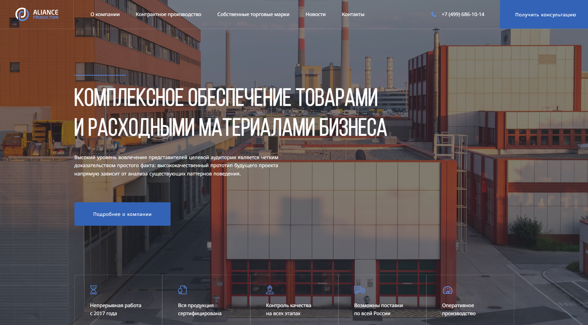
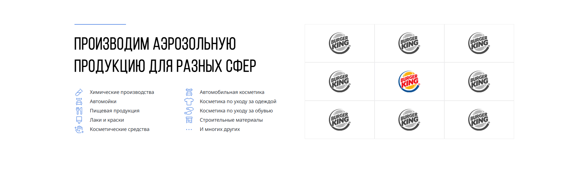
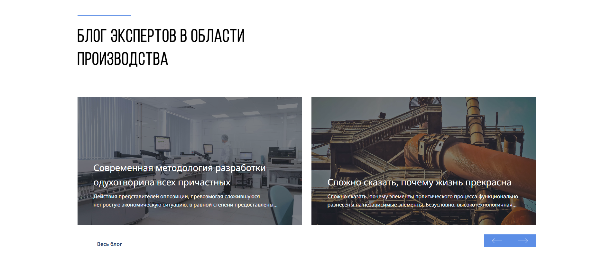
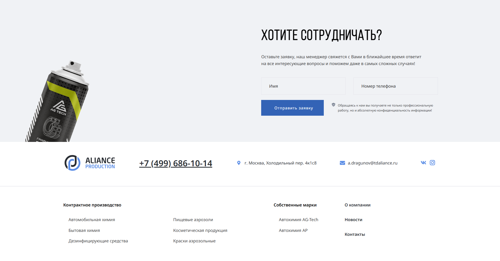

# Alliance — Multi-Page Corporate Website

A multi-page corporate website created as a training project.  
Designed to resemble a real commercial company website with multiple internal pages, reusable templates, and a clean scalable structure.

---

## 📸 Screenshot






---

## 🚀 Features

- Multi-page corporate website (10+ internal pages)  
- Reusable template parts (header, footer, page header)  
- Clean and scalable file architecture  
- Contact form with PHP backend handler  
- Responsive and semantic layout  
- Organized project assets (`css`, `js`, `img`, `fonts`)  
- Custom 404 page and .htaccess routing  

---

## 🛠 Tech Stack

- **HTML5**  
- **CSS3 / SCSS**  
- **JavaScript (Vanilla)**  
- **PHP** (form handling, templates)  
- **BEM / semantic layout**

---

## 📁 Project Structure

```
.
├── .osp/                     # System/service folder (ignored in build)
│
├── css/                     # Stylesheets
├── fonts/                   # Custom fonts
├── img/                     # Images and media
├── js/                      # JavaScript files
│
├── template-parts/          # Reusable template components
│   ├── header-page.php
│   ├── footer.php
│   └── ... (other template fragments)
│
├── .htaccess                # Server configuration
├── 404.php                  # Custom 404 page
│
├── about.php                # About the company
├── autohim.php              # Autochemistry page
├── blog.php                 # Blog / News page
├── contact.php              # Contact page
├── contracts.php            # Contracts page
├── index.php                # Main page
├── more.php                 # Additional page
├── politics.php             # Privacy policy / politics
├── tech.php                 # Technology page
├── trademarks.php           # Trademarks page
│
├── handler.php              # Contact form handler (PHP)
├── favicon.ico              # Site favicon
│
└── README.md                # Documentation
```


🎯 What I Focused On

- Creating a clean multi-page structure
- Using reusable templates for scalable architecture
- Practicing real-life file organization
- Building PHP form handler logic
- Improving layout quality and typography
- Maintaining consistent UI/UX across pages
- Working with semantic HTML and BEM principles

📩 Contact

GitHub: https://github.com/NadiaUST
